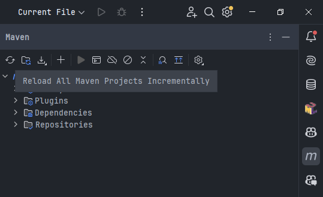
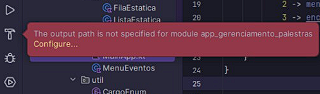
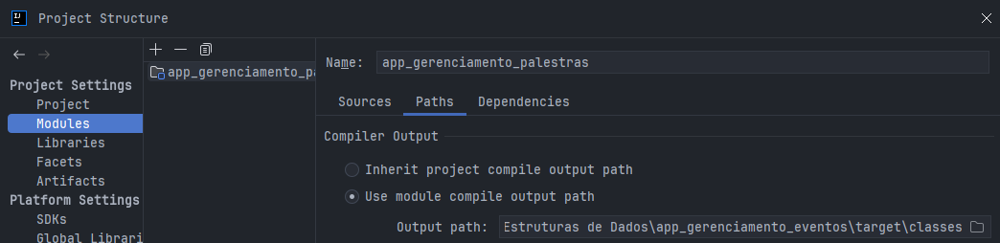

# App de Gerenciamento de Eventos

Este é um projeto de aplicativo de desktop para gerenciamento de eventos, desenvolvido em Kotlin com JavaFX. O aplicativo foi desenvolvido para a disciplina Estrutura de Dados do curso de Sistemas de Informação do IFBA campus Vitória da Conquista.

## Como Executar o Projeto Localmente

### Pré-requisitos
 - **Java Development Kit (JDK):** Certifique-se de ter o JDK 8 ou superior instalado.
 - **Maven:** Certifique-se de ter o Apache Maven instalado.
 - **Git:** Certifique-se de ter o Git instalado.
 - **IntelliJ IDEA:** Recomendado para um melhor suporte ao Kotlin e JavaFX.
 
### Passos
 - Abra o terminal e execute o seguinte comando para clonar o repositório:  
 `git clone https://github.com/vanessa-cl/app_gerenciamento_eventos.git`
 - Abra o IntelliJ IDEA.
 - Selecione File -> Open e navegue até o diretório onde você clonou o repositório.
 - Selecione a pasta app_gerenciamento_eventos e clique em OK.
 - No IntelliJ IDEA, vá até a janela Maven (geralmente localizada na barra lateral direita).
 Clique no botão Reload All Maven Projects para garantir que todas as dependências sejam baixadas e configuradas corretamente.

 - Navegue até o arquivo src/main/kotlin/ui/MainApp.kt.
 - Clique com o botão direito no arquivo e selecione Run 'MainApp'.
 - Uma janela do JavaFX deve abrir com o título "App de Gerenciamento de Eventos" e um botão "Clique aqui".
 
### Problemas Comuns
 - **Dependências do Maven:** Se houver problemas com dependências, tente executar `mvn clean install` no terminal dentro do diretório do projeto.
 - **Output Path:** Se houver problemas com o output path como apontado pelo Intellij na imagem abaixo, clique em _Configure_ e siga os passos abaixo para configurar o output path.
   
   - Ao clicar em _Configure_, clique em _Add Output Path_, em seguida o modal abaixo será exibido.
   
   - No campo _Output Path_, clique em no ícone de pasta e selecione _app_gerenciamento_eventos/target/classes_.
   - Clique em _OK_ e em seguida em _Apply_ e _OK_.
   - Faça o Reload All Maven Projects novamente.
   - Execute o arquivo MainApp.kt novamente.
   - Se o problema persistir, tente reiniciar o IntelliJ IDEA.

## Estrutura de Pastas do Projeto
A organização das pastas abaixo foi adotada para manter o código limpo, modular e simplificar o desenvolvimento e a manutenção do projeto.

```
app_gerenciamento_eventos/
├── src/
│   ├── main/
│   │   ├── kotlin/
│   │   │   ├── ui/
│   │   │   │   ├── MainApp.kt
│   │   │   ├── logic/
│   │   │   │   ├── collections/
│   │   │   │   │   ├── AgendaPalestras.kt
│   │   │   │   │   ├── FilaEspera.kt
│   │   │   │   │   ├── ListaEventos.kt
│   │   │   │   │   └── ListaParticipantes.kt
│   │   │   │   ├── entities/
│   │   │   │   │   ├── Evento.kt
│   │   │   │   │   ├── Palestra.kt
│   │   │   │   │   └── Participante.kt
│   │   │   │   ├── interfaces/
│   │   │   │   │   ├── Enfileiravel.kt
│   │   │   │   │   └── Listavel.kt
│   │   │   │   ├── structures/
│   │   │   │   │   ├── FilaEstatica.kt
│   │   │   │   │   └── ListaEstatica.kt
│   │   │   ├── util/
│   │   │   │   ├── CustomException.kt
│   │   │   │   ├── CargoEnum.kt
│   │   │   │   └── StatusEnum.kt
│   │   └── resources/
```

- **ui/:** Contém as classes relacionadas à interface do usuário (JavaFX).  
  - MainApp.kt: Classe principal que inicia a aplicação.
- **logic/:** Contém a lógica principal da aplicação.  
  - **entities/:** Contém as classes que representam as entidades principais do sistema.
    - Evento.kt, Palestra.kt, Participante.kt: Classes que representam as entidades do sistema.
  - **collections/:** Contém as classes que implementam coleções específicas.
    - ListaParticipantes.kt, AgendaPalestras.kt, FilaEspera.kt, ListaEventos.kt: Classes que utilizam estruturas de dados específicas para gerenciar listas e filas.
  - **interfaces/:** Contém as interfaces que definem contratos para as estruturas.
    ListInterface.kt: Interface que define os métodos que devem ser implementados pelas coleções.
  - **structures/:** Contém as classes que implementam estruturas de dados genéricas.
    - ListaEstatica.kt, FilaEstatica.kt: Classes que implementam listas e filas estáticas que serão utilizadas pelas coleções.
- **util/:** Contém classes utilitárias e enums.  
    - CustomExceptions.kt: Define exceções personalizadas.
    - CargoEnum.kt, StatusEnum.kt: Define enums utilizados no sistema.
- **resources/:** Contém recursos adicionais como arquivos de configuração e arquivos FXML para JavaFX.
